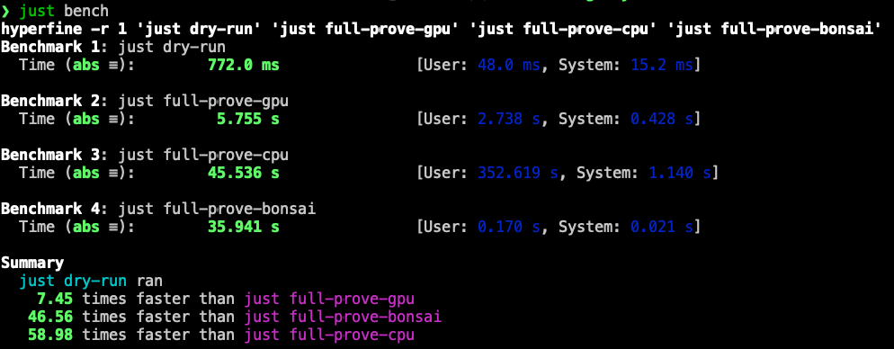
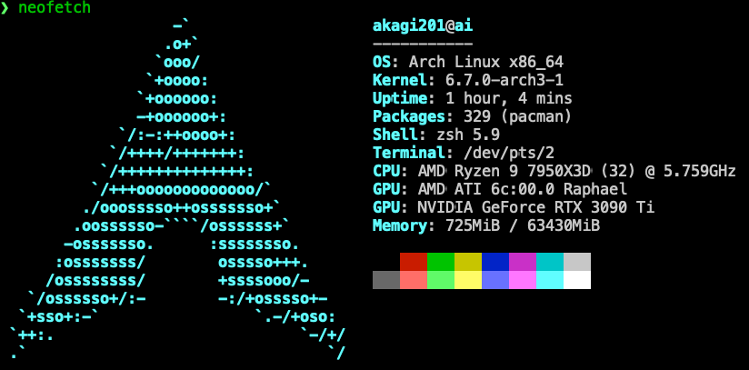
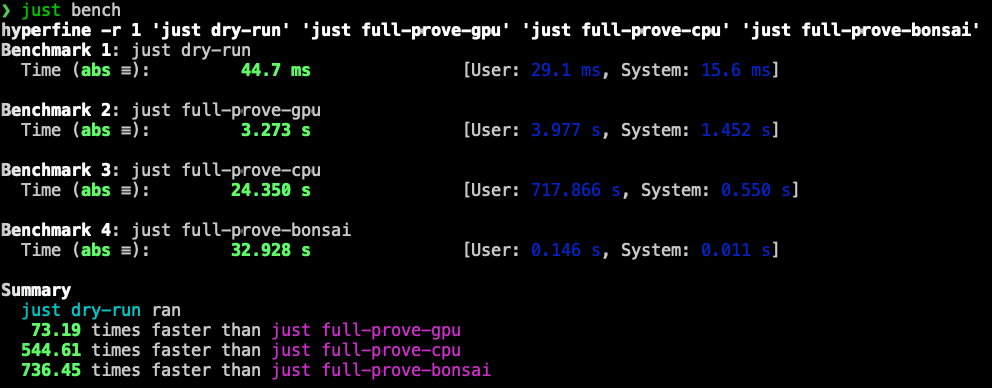

# zk orderbook dex

A simplistic in memory LOB(Limit Order Book) match engine on zkVM.

## Run

```sh
just -l
just build
just bench
```

## Benchmarks

My macOS hardware info:


Bencharks on macOS (Metal for GPU)



My linux hardware info:



Bencharks on macOS (CUDA for GPU)


