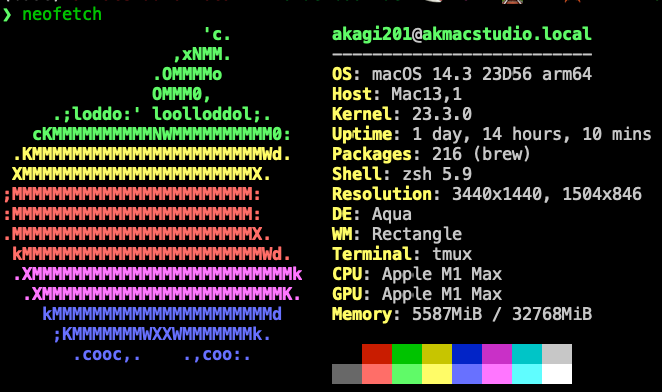

# zk orderbook dex

A simplistic in memory LOB(Limit Order Book) match engine on zkVM.

## Run

```sh
just -l
just build
just bench
```

## Poc Explain

* <https://akagi201.notion.site/ZK-Orderbook-Dex-0567b96c3e864271b7c3f17072ff14a5?pvs=4>

## Benchmarks

My macOS hardware info:



Bencharks on macOS (Metal for GPU)


My linux hardware info:


Bencharks on macOS (CUDA for GPU)


